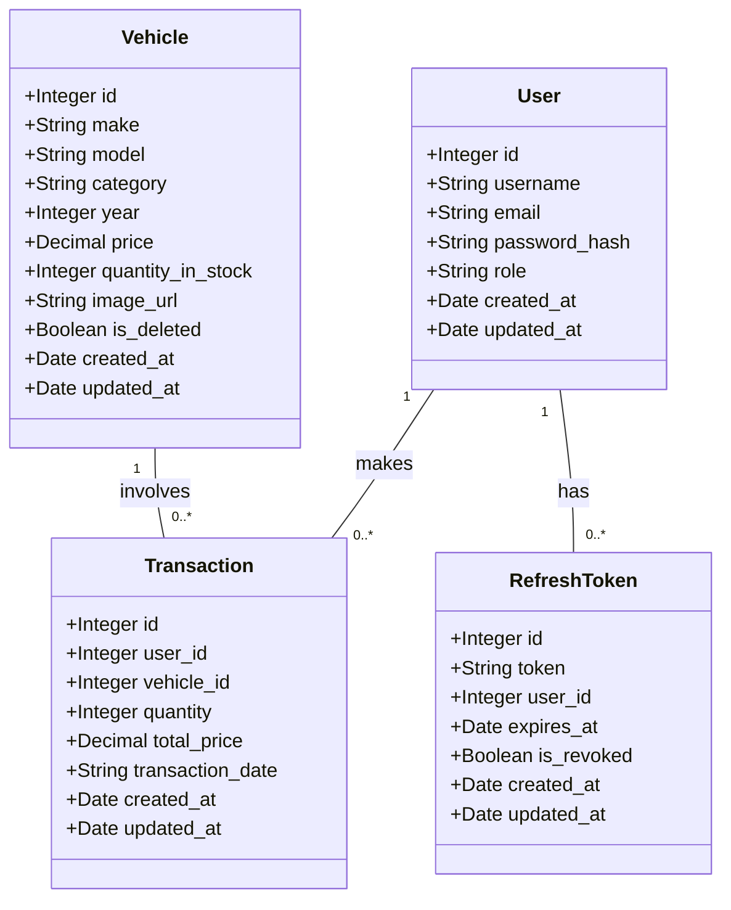
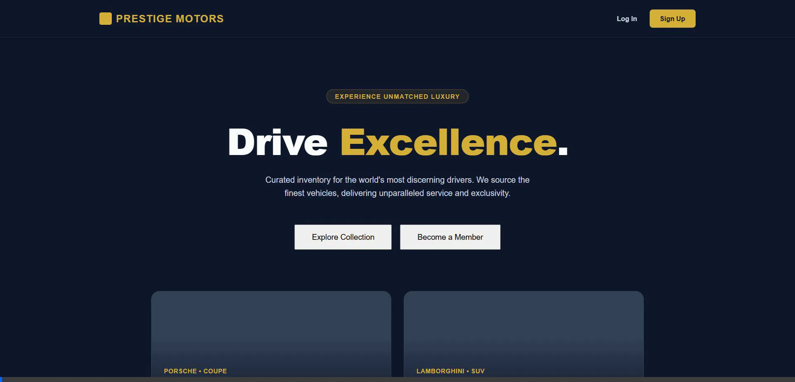
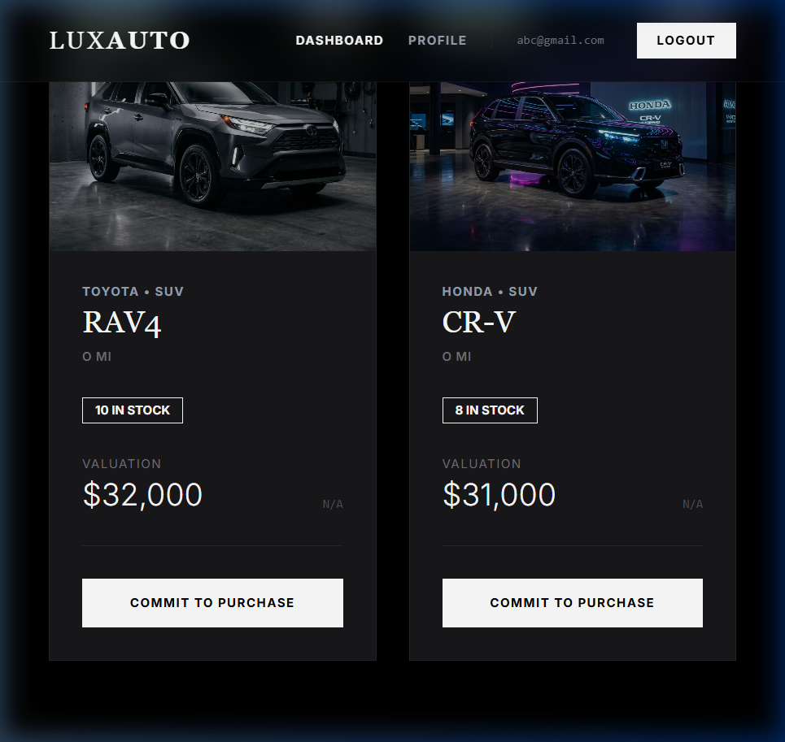

# Car Dealership Inventory System

## Project Description
The Car Dealership Inventory System is a full-stack web application designed to manage a modern car dealership's inventory and sales. It consists of a robust Node.js backend API and a dynamic React frontend application. 

The system allows administrators to manage vehicle inventory (add, update, delete, restock) while allowing regular users to browse the available collection, view details, and purchase vehicles. The frontend is fully responsive and styled with a luxury dark/gold theme to provide a premium user experience.

### Core Technologies:
- **Backend:** Node.js, Express, Sequelize, PostgreSQL, JSON Web Tokens (JWT) for authentication.
- **Frontend:** React, React Router, Context API, CSS3 for styling.

## Class Diagram (Database Schema)



## Setup and Run Instructions

### Prerequisites
- Node.js (v16 or higher)
- npm or yarn
- PostgreSQL (Ensure it is running and accessible on port 5432)

### Backend Setup
1. Open a terminal and navigate to the backend directory:
   ```bash
   cd car-dealership-api
   ```
2. Configure `.env` with your PostgreSQL credentials:
   ```env
   DB_HOST=127.0.0.1
   DB_PORT=5432
   DB_USER=myuser
   DB_PASSWORD=mypassword
   DB_NAME=car_dealership
   ```
3. Install dependencies:
   ```bash
   npm install
   ```
4. Run the development server:
   ```bash
   npm run dev
   ```
   The backend API will start on `http://localhost:3000`. The database will automatically initialize and sync.

### Frontend Setup
1. Open a separate terminal and navigate to the frontend directory:
   ```bash
   cd car-dealership-web
   ```
2. Install dependencies:
   ```bash
   npm install
   ```
3. Run the React development server:
   ```bash
   npm run dev
   ```
   The frontend will start on `http://localhost:5173`. Open this URL in your browser to interact with the application.

## Screenshots

**Inventory / Dashboard View**


**Admin Dashboard**

